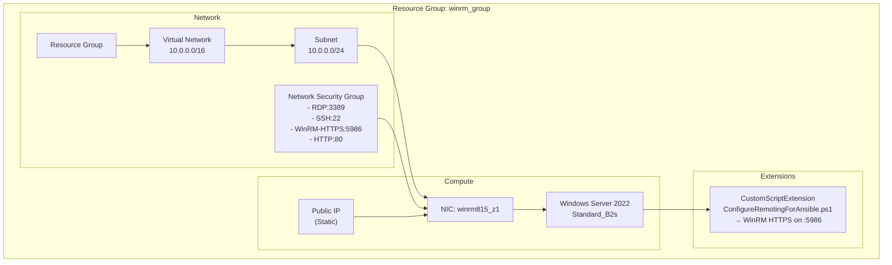
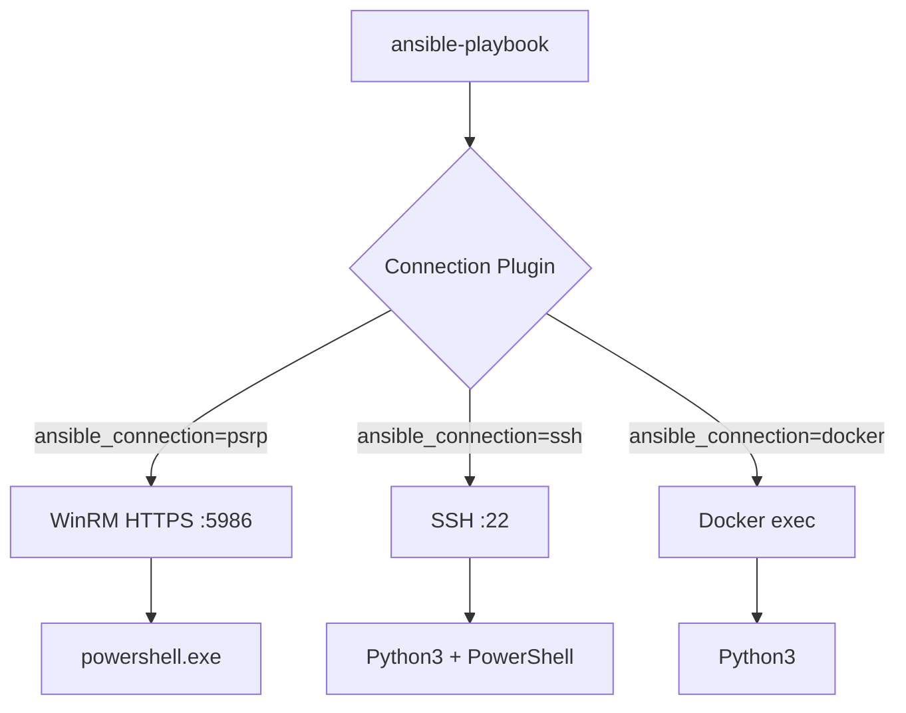

# ansible-labs

> **Story:** Terraform builds the house. Ansible furnishes it. — `ansible/` is the reference solution; this README is the step-by-step path to get there (WSL = control node, Azure Windows = managed node).

Lab flow (from instructor guide):

```
PHASE 1  Hosts Setup (Terraform + Docker)
PHASE 2  Why Ansible
PHASE 3  Install Ansible + Ad-hoc Basics
PHASE 4  Connections: WinRM vs PSRP
PHASE 5  Static Inventory + First Connection
PHASE 6  First Playbook + Facts
PHASE 7  Variables + Precedence
PHASE 8  Vault
PHASE 9  Guestbook App: PHP + IIS + Jinja2
PHASE 10 Roles + Handlers
PHASE 11 Dynamic Inventory
PHASE 12 Verification + Lint
PHASE 13 CI/CD (Azure DevOps)
```


---

## PHASE 1 — Hosts Setup (Terraform + Docker)

### Azure Resources Terraform Creates



### Terraform Commands

```bash
cd terraform
terraform init && terraform fmt && terraform validate
terraform plan
terraform apply
terraform output
```

Output example:
```
public_ip     = "20.x.x.x"
resource_group_name = "ansible-student01-rg"
vm_name       = "ansible-student01-vm"
computer_name = "web-student01"
```

```
 docker run -d --name ansible-test --rm alpine sleep 6000
```

```
docker run -d --name ansible-test1 --rm python:3.14.7-bookworm sleep 6000
```

> Keep these two containers running — `ansible-test` (Alpine, no Python) and `ansible-test1` (has Python) come back in PHASE 5 to demonstrate why Ansible needs Python on every managed node.

---

## PHASE 2 — Why Ansible

1. **Agentless** — No daemon on managed nodes. SSH/WinRM is already there. Install Ansible on one machine, control thousands.
2. **Idempotent** — Run same playbook 100 times, result is the same. `state: present` doesn't re-install if already present.
3. **Reads like English** — YAML tasks describe *what* you want, not *how*. `win_feature: { name: Web-Server, state: present }` — students can read it day one.
4. **One language, all platforms** — Same Ansible playbook configures Windows (WinRM), Linux (SSH), and Docker containers. No separate tool per OS.
5. **Infrastructure as Code** — Playbooks are versioned in Git. Track changes, review PRs, rollback. `terraform.tfvars` creates the VM; Ansible playbooks configure what's inside.

---

## PHASE 3 — Install Ansible (Python venv) + Ad-hoc Basics

```bash
# In WSL Ubuntu
sudo apt install -y python3 python3-pip python3-venv git curl jq openssl netcat-openbsd
python3 -m venv .venv
source .venv/bin/activate
pip install ansible==14.3.1 pypsrp==0.9.1
ansible --version
```


```bash
ansible localhost -m ping
```

```bash
ansible localhost -m command -a "uname -a"
```

```bash
ansible localhost -m shell -a "df -h"
```

> **A module is a unit of work Ansible knows how to perform.**


```ini
[local]
localhost ansible_connection=local
```

Run:

```bash
ansible -i inventory.ini local -m ping
```

## PHASE 4 — Connections: WinRM vs PSRP

| | WinRM | PSRP |
|---|---|---|
| **What** | Windows Remote Management — HTTP/HTTPS protocol for remote commands | PowerShell Remoting Protocol — runs PowerShell specifically over WinRM |
| **Port** | 5985 (HTTP) / 5986 (HTTPS) | 5986 (same transport, different protocol layer) |
| **Inventory var** | `ansible_connection=winrm` | `ansible_connection=psrp` |
| **When to use** | Older or generic Windows targets | Modern Windows (recommended) — better error handling, native PowerShell |
| **Needs on target** | WinRM service running | WinRM service + PowerShell (built-in on Server 2012+) |

**TL;DR:** PSRP is the better version of WinRM for Ansible. Both use the same port (5986). PSRP sends PowerShell objects directly; WinRM sends text strings that the target interprets. Use `psrp`.

### How it works on the remote node

**WinRM** (`ansible_connection=winrm`):

```text
Control Node                          Managed Node (Windows)
┌──────────────┐                      ┌────────────────────────────────┐
│ ansible      │──── HTTPS :5986 ────▶│ WinRM Service                  │
│              │                      │   ├─ Receive: "Get-Service W3SVC"│
│              │◀─── JSON ───────────   ├─ Execute via cmd.exe        │
└──────────────┘                      │   └─ Return: {stdout, rc}      │
                                      └────────────────────────────────┘
```

Text goes in → `cmd.exe` or `powershell.exe` interprets it → result text comes back as JSON.

**PSRP** (`ansible_connection=psrp`):

```text
Control Node                          Managed Node (Windows)
┌──────────────┐                      ┌────────────────────────────────┐
│ ansible      │──── HTTPS :5986 ────▶│ WinRM Service                  │
│              │                      │   ├─ Receive: serialized object │
│              │◀─── JSON ───────────│   ├─ Execute in PowerShell      │
└──────────────┘                      │   └─ Return: structured object │
                                      └────────────────────────────────┘
```

PowerShell objects go in → PowerShell runtime executes directly → structured object comes back. No cmd.exe shell.

**Same task, different path:**

```text
ansible.windows.win_service: { name: W3SVC }

WinRM:  sends string "Get-Service W3SVC" → cmd.exe → runs PowerShell → parses text output
PSRP:   sends object {ModuleName: "W3SVC"} → PowerShell.exe → returns ServiceController object directly
```

> PSRP handles errors, output types, and large results better because it speaks PowerShell natively.

---

## PHASE 5 — Static Inventory + First Connection (Guide §22-26)

Recap — which connection plugin routes where:



| Connection | Transport | Managed Node Needs | Use Case |
|-----------|-----------|-------------------|----------|
| `psrp` | WinRM HTTPS :5986 | PowerShell | Windows (recommended, see PHASE 4) |
| `winrm` | WinRM HTTPS :5986 | PowerShell | Windows (older) |
| `ssh` | SSH :22 | Python3 | Linux / Windows (OpenSSH) |
| `docker` | Docker API | Python3 | Local containers |

Verify the port is reachable from WSL before pointing Ansible at it:
```bash
nc -zv <PUBLIC_IP> 5986
# Connection to <PUBLIC_IP> 5986 port [tcp/wsmans] succeeded!
```

Troubleshoot order (teach this):
```
Public IP → NSG → Windows Firewall → WinRM service → Listener → Certificate → Ansible
```

Create `ansible/inventory/windows.ini`:

```ini
[windows]
student01 ansible_host=20.x.x.x

[windows:vars]
ansible_connection=psrp
ansible_port=5986
ansible_user=<your-name>
ansible_password=<password>
ansible_psrp_auth=basic
ansible_psrp_cert_validation=ignore
```

Ad-hoc test:
```bash
ansible -i ansible/inventory/windows.ini windows -m ansible.windows.win_ping
# student01 | SUCCESS => {"changed": false, "ping": "pong"}
```

#### Fun Fact — `win_ping` Is Not Ping

```text
Does win_ping send ICMP packets?
```

> No. `win_ping` is an Ansible module that verifies communication with a Windows host — it doesn't send ICMP.

Actual network connectivity can be checked separately:
```bash
nc -zv <IP> 5986
# or
ping <IP>   # although ICMP can be blocked
```

Now do the same thing as a playbook instead of an ad-hoc command — `ansible/playbooks/ping.yml`:
```yaml
---
- name: Test Windows connectivity
  hosts: windows
  gather_facts: false
  tasks:
    - ansible.windows.win_ping:
```

```bash
ansible-playbook -i ansible/inventory/windows.ini ansible/playbooks/ping.yml
```

---

### Putting it together — what just happened

1. **You write a playbook** (`ping.yml`) describing tasks against a `hosts:` group.
2. **Ansible reads the inventory** (`windows.ini`) to resolve `windows` into `student01`.
3. **The connection plugin** (`psrp`, from PHASE 4) decides how to reach it — WinRM HTTPS on :5986.
4. **The target needs Python (or PowerShell for Windows).** Modules are scripts Ansible copies to the target and executes there — no Python/PowerShell runtime, no result. Try it against the two containers from PHASE 1:
   ```bash
   ansible ansible-test -m ping -e "ansible_connection=docker" -i "ansible-test,"
   ansible ansible-test1 -m ping -e "ansible_connection=docker" -i "ansible-test1,"
   ```
   ```text
   ansible-test  (Alpine, no Python) | UNREACHABLE! "Failed to create temporary directory"
   ansible-test1 (has Python)        | SUCCESS => {"changed": false, "ping": "pong"}
   ```
   Same lesson applies to Windows: no PowerShell/WinRM listener, no result.

---

## PHASE 6 — First Playbook + Facts
Now change:

``` yaml
gather_facts: false
```

to:

``` yaml
gather_facts: true
```

Playbook:

`playbooks/facts.yml`

``` yaml
---
- name: Gather Windows information
  hosts: windows

  tasks:
    - name: Show Windows hostname
      ansible.builtin.debug:
        var: ansible_hostname

    - name: Show OS family
      ansible.builtin.debug:
        var: ansible_os_family

    - name: Show operating system
      ansible.builtin.debug:
        var: ansible_distribution
```

Run:

``` bash
ansible-playbook \
  -i inventory/windows.ini \
  playbooks/facts.yml
```


> Facts=information Ansible discovers about the managed machine


---

## PHASE 7 — Variables + Precedence 

in `ansible/playbook/hello.yml`
```yaml
---
- name: Write hello world to desktop
  hosts: windows
  tasks:
    - name: Write hello world text file to desktop
      ansible.windows.win_copy:
        content: "hello world"
        dest: "C:\\User\\<username>\\Desktop\\hello.txt"

    - name: Create application directory
      ansible.windows.win_file:
        path: "C:\apps\training"
        state: directory

```


```yaml
---
- name: Write hello world to desktop
  hosts: windows
  tasks:
    - name: Write hello world text file to desktop
      ansible.windows.win_copy:
        content: "hello world"
        dest: "{{ ansible_facts['env'].USERPROFILE }}\\Desktop\\hello.txt"

    - name: Create application directory
      ansible.windows.win_file:
        path: "{{ training_path }}"
        state: directory

    - name: Show host variable value
      ansible.builtin.debug:
        msg: "training_path for {{ inventory_hostname }} is {{ training_path }}"
```

Start simple `ansible/playbooks/variables.yml`:
```yaml
---
- name: Variable demonstration
  hosts: windows
  vars:
    application_name: "Training IIS Application"
    application_port: 8080
  tasks:
    - debug: { msg: "Application: {{ application_name }}" }
    - debug: { msg: "Port: {{ application_port }}" }
```

`debug:` and `ansible.builtin.debug:` are the **same module** — Ansible resolves both.

| Form | Example | When to use |
|------|---------|-------------|
| **Short** | `debug: { msg: "hi" }` | Quick labs, playbooks you write yourself |
| **FQCN** | `ansible.builtin.debug: { msg: "hi" }` | Production, roles, shared code — tells Ansible exactly which collection to use |

**Why FQCN exists:** If two collections both have a `debug` module, Ansible doesn't know which to pick. FQCN removes ambiguity:

```yaml
- ansible.builtin.debug: { msg: "builtin" }      # from ansible-core
- community.general.debug: { msg: "community" }   # hypothetical — different module
```

**Rule of thumb for this lab:** Short form is fine for playbooks you write. When you start using roles and collections from Galaxy, use FQCN.


### Variable files

`ansible/group_vars/windows.yml`:
```yaml
---
application_name: "Training IIS"
application_path: "C:\\apps\\training"
iis_site_name: "TrainingSite"
iis_port: 8080
environment: "development"
```

```bash
ansible-playbook -i ansible/inventory/windows.ini ansible/playbooks/variables.yml
```

Playbook reads them automatically (no `-e` needed).

> you can do ansible dry check to check which variable preceds

### Precedence experiment 

1. `group_vars/windows.yml: application_port: 8080` → output: `Port: 8080`
2. Add play `vars: { application_port: 9090 }` → output: `Port: 9090`
3. `ansible-playbook ... -e "application_port=9999"` → output: `Port: 9999`

```
-e (wins)
Play/task vars
Host vars
Group vars   
Defaults
```


### Host vars (per-host override)

`ansible/host_vars/student01.yml`:
```yaml
training_path: C:\apps\training
```

`ansible/playbooks/variables.yml` uses `path: "{{ training_path }}"` — no change. Add `student02` with different path → same playbook, different per-host value.

#### Why Variables Matter

Without variables:

``` yaml
path: C:\apps\training
```

With variables:

``` yaml
path: "{{ application_path }}"
```

Now the same role can use:

``` text
Development:
C:\apps\training-dev

Production:
C:\apps\training
```

**How it works:** Ansible loads `group_vars/<group>.yml` based on which group the host belongs to. Dev hosts are in `[development]` group → get `development.yml`. Prod hosts are in `[production]` group → get `production.yml`. Same variable name, different value.

**Just an example(dont do this):**

```ini
# inventory/windows.ini
[development]
dev01 ansible_host=20.10.1.10
dev02 ansible_host=20.10.1.11

[production]
prod01 ansible_host=20.10.2.10
prod02 ansible_host=20.10.2.11
```

```yaml
# group_vars/development.yml
application_path: "C:\\apps\\training-dev"
environment: "development"
iis_port: 8080
```

```yaml
# group_vars/production.yml
application_path: "C:\\apps\\training"
environment: "production"
iis_port: 80
```

```bash
ansible-playbook -i inventory/windows.ini playbooks/iis.yml -l development
# → dev01, dev02 get C:\apps\training-dev, port 8080

ansible-playbook -i inventory/windows.ini playbooks/iis.yml -l production
# → prod01, prod02 get C:\apps\training, port 80
```

Same playbook, same role, same template — different `group_vars` file per environment.
---

## PHASE 8 — Vault

```bash
mkdir -p group_vars/windows
ansible-vault create ansible/group_vars/windows/vault.yml
# Enter password, then:
app_db_server: "sql-training.database.windows.net"
app_db_name: "training"
app_db_username: "training_app"
app_db_password: "REPLACE_WITH_SECRET"

```

```bash
cat group_vars/windows/vault.yml
```

Run:
```bash
ansible-playbook -i inventory/windows.ini playbooks/iis.yml --ask-vault-pass
# or --vault-password-file ~/.ansible-vault-password (chmod 600, never commit)
```

### Move inventory credentials to vault

**Before (plaintext in git — never do this):**

```ini
# inventory/windows.ini
[windows:vars]
ansible_user=wakizu
ansible_password=!BRr39E,BAPUWq    
```

**After (encrypted in vault):**

```ini
# inventory/windows.ini
[windows:vars]
ansible_user=wakizu                 
# ansible_password removed — now in vault
```

```yaml
# group_vars/windows/vault.yml (encrypted)
---
ansible_password: "!BRr39E,BAPUWq"
app_db_password: "SuperSecret123"
```

```bash
ansible-vault encrypt group_vars/windows/vault.yml
cat group_vars/windows/vault.yml  # $ANSIBLE_VAULT;1.1;AES256

# run with vault
ansible-playbook -i inventory/windows.ini playbooks/iis.yml --ask-vault-pass
```

> `ansible_password` is just a variable like any other — Ansible reads it from vault. Git now sees only the encrypted file.

---

## Jinja2 in 2 minutes

Jinja2 is a templating engine. Ansible uses it to render config files with variables.

### Before (hardcoded)

`hello.yml`:
```yaml
- ansible.windows.win_copy:
    content: "hello world"
    dest: "{{ ansible_facts['env'].USERPROFILE }}\\Desktop\\hello.txt"
```

### After (template with variables)

Create `templates/hello.txt.j2`:
```jinja2
Hello {{ ansible_facts['env'].COMPUTERNAME }}!

User: {{ ansible_facts['env'].USERNAME }}
Host: {{ inventory_hostname }}
Date: {{ ansible_date_time.date }}
```

Update `hello.yml`:
```yaml
- ansible.windows.win_template:
    src: templates/hello.txt.j2
    dest: "{{ ansible_facts['env'].USERPROFILE }}\\Desktop\\hello.txt"
```

Result on VM:
```
Hello WEB-01!

User: wakizu
Host: student01
Date: 2026-08-29
```

**Key Jinja2 features:**

| Syntax | Example | Output |
|--------|---------|--------|
| Variable | `{{ variable }}` | `wakizu` |
| Filter | `{{ name \| upper }}` | `WAKIZU` |
| Default | `{{ x \| default("n/a") }}` | `n/a` if x is undefined |
| Conditional | `true` | `true` if dev |
| Loop | `{{ i }}` | all items |

> **Rule:** Put logic in variables, not templates. Keep templates simple.


---

## PHASE 9 — Guestbook App: PHP + IIS + Jinja2 


### The application: Student Guestbook

```text
Browser → IIS → PHP → SQLite
```

A one-page app: a form (name + message), saved to SQLite, listed below the form. Deliberately minimal — no ORM, no build step, one dependency (PHP), one file (`database.sqlite`) instead of a database server.


Deploy layout (source lives in `ansible/roles/iis/files/guestbook/` for now; moves into the role in PHASE 10):
```text
guestbook/
├── index.php.j2      # templated — title comes from Ansible vars
├── database.php       # static — no per-environment differences
└── config.php.j2      # templated — app-layer config, distinct from web.config.j2
```

### Exercise 1 — Install PHP on IIS

```yaml
- name: Install PHP via Chocolatey
  chocolatey.chocolatey.win_chocolatey:
    name: php
    state: present

- name: Enable IIS CGI feature
  ansible.windows.win_feature:
    name: Web-CGI
    state: present

- name: Register PHP with IIS FastCGI
  community.windows.win_iis_webapplication:   # or a raw appcmd task if this module isn't available
    name: "{{ iis_site_name }}"
    site: "{{ iis_site_name }}"
    physical_path: "{{ application_path }}"
```

> Treat the exact FastCGI registration as instructor-provided — the point of the exercise is the *pattern* (install runtime → enable feature → wire it to IIS), not memorizing IIS/PHP plumbing.

### Exercise 2 — Deploy the application files

```yaml
- name: Deploy static application files
  ansible.windows.win_copy:
    src: files/guestbook/database.php
    dest: "{{ application_path }}\\database.php"

- name: Deploy templated index page
  ansible.windows.win_template:
    src: templates/index.php.j2
    dest: "{{ application_path }}\\index.php"

- name: Deploy templated app config
  ansible.windows.win_template:
    src: templates/config.php.j2
    dest: "{{ application_path }}\\config.php"
```

`database.php` (static — same in every environment):
```php
<?php
$db = new PDO('sqlite:' . __DIR__ . '/database.sqlite');
$db->setAttribute(PDO::ATTR_ERRMODE, PDO::ERRMODE_EXCEPTION);
$db->exec("
    CREATE TABLE IF NOT EXISTS messages (
        id INTEGER PRIMARY KEY AUTOINCREMENT,
        name TEXT NOT NULL,
        message TEXT NOT NULL,
        created_at DATETIME DEFAULT CURRENT_TIMESTAMP
    )
");
```

`index.php.j2` — same PHP as a static `index.php` would have, but the title is now a Jinja2 variable:
```php
<?php
require_once 'database.php';

if ($_SERVER['REQUEST_METHOD'] === 'POST') {
    $name = trim($_POST['name'] ?? '');
    $message = trim($_POST['message'] ?? '');
    if ($name !== '' && $message !== '') {
        $stmt = $db->prepare("INSERT INTO messages (name, message) VALUES (:name, :message)");
        $stmt->execute([':name' => $name, ':message' => $message]);
    }
    header('Location: /');
    exit;
}

$stmt = $db->query("SELECT name, message, created_at FROM messages ORDER BY id DESC");
$messages = $stmt->fetchAll(PDO::FETCH_ASSOC);
?>
<!DOCTYPE html>
<html>
<head><title>{{ application_name }}</title></head>
<body>
<h1>{{ application_name }} <small>({{ environment }})</small></h1>

<form method="POST">
    <label>Name</label><input type="text" name="name" required>
    <label>Message</label><textarea name="message" rows="4" required></textarea>
    <button type="submit">Submit</button>
</form>

<h2>Messages</h2>
<?php foreach ($messages as $row): ?>
    <div class="message">
        <div class="name"><?= htmlspecialchars($row['name']) ?></div>
        <p><?= htmlspecialchars($row['message']) ?></p>
        <div class="date"><?= htmlspecialchars($row['created_at']) ?></div>
    </div>
<?php endforeach; ?>
</body>
</html>
```

> Same idea as `web.config.j2` from before, just one layer up the stack: `web.config.j2` configures **IIS**; `index.php.j2` configures the **application it's serving**. Worth pointing out explicitly — two different things get templated for two different reasons.

`config.php.j2` — the app-layer config chain, deliberately separate from `web.config.j2`:
```php
<?php
return [
    'app_name'    => '{{ application_name }}',
    'environment' => '{{ environment }}',
    'database'    => '{{ database_path }}',
];
```

```text
Ansible variables → Jinja2 → PHP configuration → Application
```
This is a cleaner demonstration of configuration management than changing an HTML title — the same variable now flows through two independent templates (`web.config.j2` for IIS, `config.php.j2` for the app) at once.

Env files gain two more keys:
- `group_vars/development.yml`: `application_name: "Guestbook - DEV"`, `database_path: "C:\\apps\\training-dev\\database.sqlite"`
- `group_vars/production.yml`: `application_name: "Guestbook"`, `database_path: "C:\\apps\\training\\database.sqlite"`

Same two templates → four rendered files (`web.config` + `index.php` + `config.php` × dev/prod). Keep logic in vars, use filters `| upper | default("x") | replace("-", "_")`.

### Bonus challenge — the permissions gotcha

Deploy the app, load the page — it renders. Submit the form — a database permission error.

> **The task:** SQLite needs the IIS application-pool identity to have write permission on the directory containing `database.sqlite`, not just the site's read access. Find out why the form fails and fix it with an Ansible task (hint: it's a permissions module, not a `win_copy` problem).

This is real-world Ansible debugging, same spirit as the `win_ping` fun fact and the WinRM troubleshoot-order box back in PHASE 4/5 — don't hand students the fix.

---

## PHASE 10 — Roles + Handlers (Guide §52-57)

```bash
ansible-galaxy role init ansible/roles/iis
```

```
roles/iis/
├── defaults/main.yml
├── handlers/main.yml
├── tasks/main.yml
├── files/guestbook/database.php
├── templates/web.config.j2
├── templates/index.php.j2
├── templates/config.php.j2
└── meta/main.yml
```

Move everything into role — including the guestbook files from PHASE 9's `files/guestbook/` and `templates/`:

`defaults/main.yml`:
```yaml
application_name: "Training IIS"
application_path: "C:\\apps\\training"
database_path: "C:\\apps\\training\\database.sqlite"
iis_site_name: "TrainingSite"
iis_port: 80
environment: "development"
```

`tasks/main.yml`:
```yaml
---
- name: Install IIS
  ansible.windows.win_feature:
    name: [Web-Server, Web-Mgmt-Tools]
    state: present
    include_management_tools: true

- name: Install PHP via Chocolatey
  chocolatey.chocolatey.win_chocolatey:
    name: php
    state: present

- name: Enable IIS CGI feature
  ansible.windows.win_feature:
    name: Web-CGI
    state: present

- name: Create application directory
  ansible.windows.win_file:
    path: "{{ application_path }}"
    state: directory

- name: Deploy web.config
  ansible.windows.win_template:
    src: web.config.j2
    dest: "{{ application_path }}\\web.config"
  notify: Restart IIS

- name: Deploy static database.php
  ansible.windows.win_copy:
    src: guestbook/database.php
    dest: "{{ application_path }}\\database.php"

- name: Deploy templated index page
  ansible.windows.win_template:
    src: index.php.j2
    dest: "{{ application_path }}\\index.php"

- name: Deploy templated app config
  ansible.windows.win_template:
    src: config.php.j2
    dest: "{{ application_path }}\\config.php"

- name: Ensure IIS service is running
  ansible.windows.win_service:
    name: W3SVC
    state: started
    start_mode: auto
```

> The permissions fix from PHASE 9's bonus challenge belongs here too, right after the file deploys — leave it as a task for students to add.

`handlers/main.yml`:
```yaml
---
- name: Restart IIS
  ansible.windows.win_service:
    name: W3SVC
    state: restarted
```

Final `ansible/playbooks/site.yml`:
```yaml
---
- name: Configure Windows IIS servers
  hosts: web
  gather_facts: true
  roles:
    - role: iis
```

```bash
ansible-playbook -i ansible/inventory/azure_rm.yml ansible/playbooks/site.yml --ask-vault-pass
```

---

## PHASE 11 — Azure Dynamic Inventory (optional)

Tag VMs:
```bash
az vm update -g ansible-student01-rg -n ansible-student01-vm \
  --set tags.Role=web tags.Environment=development tags.Application=training-iis
```

`ansible/inventory/azure_rm.yml`:
```yaml
---
plugin: azure.azcollection.azure_rm
auth_source: cli
include_vm_resource_groups:
  - ansible-student01-rg
conditional_groups:
  web: "'web' == (tags.Role | default(''))"
  database: "'database' == (tags.Role | default(''))"
  development: "'development' == (tags.Environment | default(''))"
  production: "'production' == (tags.Environment | default(''))"
# OR keyed_groups:
# keyed_groups:
#   - prefix: role
#     key: tags.Role
#   - prefix: environment
#     key: tags.Environment
```

```bash
ansible-inventory -i ansible/inventory/azure_rm.yml --graph
# @all: |--@web: |  |--student01
ansible -i ansible/inventory/azure_rm.yml web -m ansible.windows.win_ping
ansible-playbook -i ansible/inventory/azure_rm.yml ansible/playbooks/site.yml --ask-vault-pass -l "web:&development"
```

No more editing `windows.ini` when IPs change. **Tags become inventory.**

---

## PHASE 12 — Verification + Lint (Guide §58-62)

`ansible/playbooks/verify.yml`:
```yaml
---
- name: Verify IIS configuration
  hosts: web
  gather_facts: false
  tasks:
    - win_service_info: { name: W3SVC } register: iis_service
    - assert:
        that:
          - iis_service.services | length > 0
          - iis_service.services[0].state == "started"
        fail_msg: "IIS service is not running"
        success_msg: "IIS service is running"
    - win_stat: { path: "{{ application_path }}" } register: app_dir
    - assert:
        that:
          - app_dir.stat.exists
          - app_dir.stat.isdir
    - win_stat: { path: "{{ application_path }}\\web.config" } register: wc
    - assert:
        that:
          - wc.stat.exists
          - wc.stat.size > 0
    - win_stat: { path: "{{ application_path }}\\index.php" } register: app_index
    - assert:
        that:
          - app_index.stat.exists
        fail_msg: "Guestbook index.php was not deployed"
    - win_stat: { path: "{{ database_path }}" } register: app_db
    - assert:
        that:
          - app_db.stat.exists
        fail_msg: "database.sqlite missing — has the app ever been submitted to successfully?"
```

```bash
pip install ansible-lint
ansible-lint
ansible-playbook -i inventory/azure_rm.yml playbooks/site.yml --syntax-check
ansible-inventory -i inventory/azure_rm.yml --graph
ansible -i inventory/azure_rm.yml web -m ansible.windows.win_ping
ansible-playbook -i inventory/azure_rm.yml playbooks/site.yml --ask-vault-pass
ansible-playbook -i inventory/azure_rm.yml playbooks/verify.yml --ask-vault-pass
curl -I http://<VM_PUBLIC_IP>
```

---

## PHASE 13 — CI/CD (Guide §63-67)

`azure-pipelines.yml`:
```yaml
trigger: [main]
pool: { vmImage: ubuntu-latest }
variables: { ANSIBLE_FORCE_COLOR: "1" }

stages:
- stage: Validate
  displayName: Validate Ansible
  jobs:
  - job: Lint
    steps:
    - checkout: self
    - task: UsePythonVersion@0 { inputs: { versionSpec: "3.x" } }
    - script: |
        python -m pip install --upgrade pip
        pip install ansible ansible-lint
        ansible-galaxy collection install -r requirements.yml
      displayName: Install
    - script: ansible-lint
      displayName: Lint
    - script: ansible-playbook -i inventory/azure_rm.yml playbooks/site.yml --syntax-check
      displayName: Syntax check

- stage: Deploy
  dependsOn: Validate
  condition: succeeded()
  jobs:
  - job: DeployAnsible
    steps:
    - checkout: self
    - task: UsePythonVersion@0 { inputs: { versionSpec: "3.x" } }
    - script: |
        python -m pip install --upgrade pip
        pip install ansible
        ansible-galaxy collection install -r requirements.yml
      displayName: Install
    - task: AzureCLI@2
      inputs:
        azureSubscription: "YOUR-SERVICE-CONNECTION"
        scriptType: bash
        scriptLocation: inlineScript
        inlineScript: |
          ansible-playbook -i inventory/azure_rm.yml playbooks/site.yml --vault-password-file "$(VAULT_PASSWORD_FILE)"
      displayName: Run Ansible

- stage: Verify
  dependsOn: Deploy
  condition: succeeded()
  jobs:
  - job: Verify
    steps:
    - script: ansible-playbook -i inventory/azure_rm.yml playbooks/verify.yml
      displayName: Verify
```

**Secret handling:** Never commit `VAULT_PASSWORD_FILE`. Create securely in pipeline (service connection / workload identity / secret variable → temp file → remove after).

---


## Collections Explained

| Collection | Purpose | Key Plugins |
|------------|---------|-------------|
| `ansible.windows` | Windows modules | `win_feature`, `win_service`, `win_copy`, `win_template`, `win_ping`, `win_file` |
| `community.windows` | Extra Windows | `win_iis_website`, `win_firewall_rule`, `win_reboot` |
| `azure.azcollection` | Azure integration | `azure_rm` inventory, `azure_rm_virtualmachine` module |
| `chocolatey.chocolatey` | Windows package installs | `win_chocolatey` — used in PHASE 9/10 to install PHP |
| `ansible.posix` | Linux basics | `firewalld`, `selinux`, `synchronize` |

Install via `requirements.yml`:
```yaml
collections:
  - name: ansible.windows
  - name: community.windows
  - name: azure.azcollection
  - name: chocolatey.chocolatey
```
```bash
ansible-galaxy collection install -r requirements.yml
```

---

## Quick Reference Commands

```bash
# Static inventory
ansible windows -i inventory/windows.ini -m ansible.windows.win_ping
ansible-playbook -i inventory/windows.ini playbooks/site.yml --ask-vault-pass

# Dynamic inventory
ansible-inventory -i inventory/azure_rm.yml --graph
ansible -i inventory/azure_rm.yml "web:&development" -m ansible.windows.win_ping
ansible-playbook -i inventory/azure_rm.yml playbooks/site.yml --ask-vault-pass -l "web:&development"

# Debug
ansible-config dump --only-changed
ansible-inventory -i inventory/azure_rm.yml --list
nc -zv <IP> 5986

# Verify
curl -I http://<VM_PUBLIC_IP>
```

---

Full instructor guide (13 modules, troubleshooting tree, student challenge, assessment):
`~/Documents/Obsidian Vault/StartSmall Works/Hitachi/Ansible/ansible_azure_wsl_full_training_guide.md`
