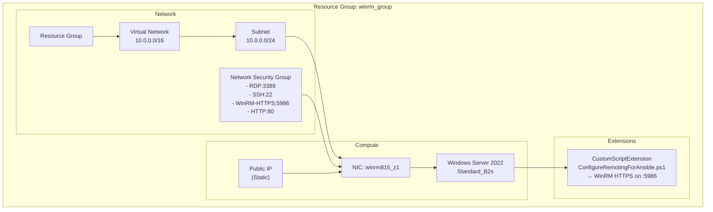
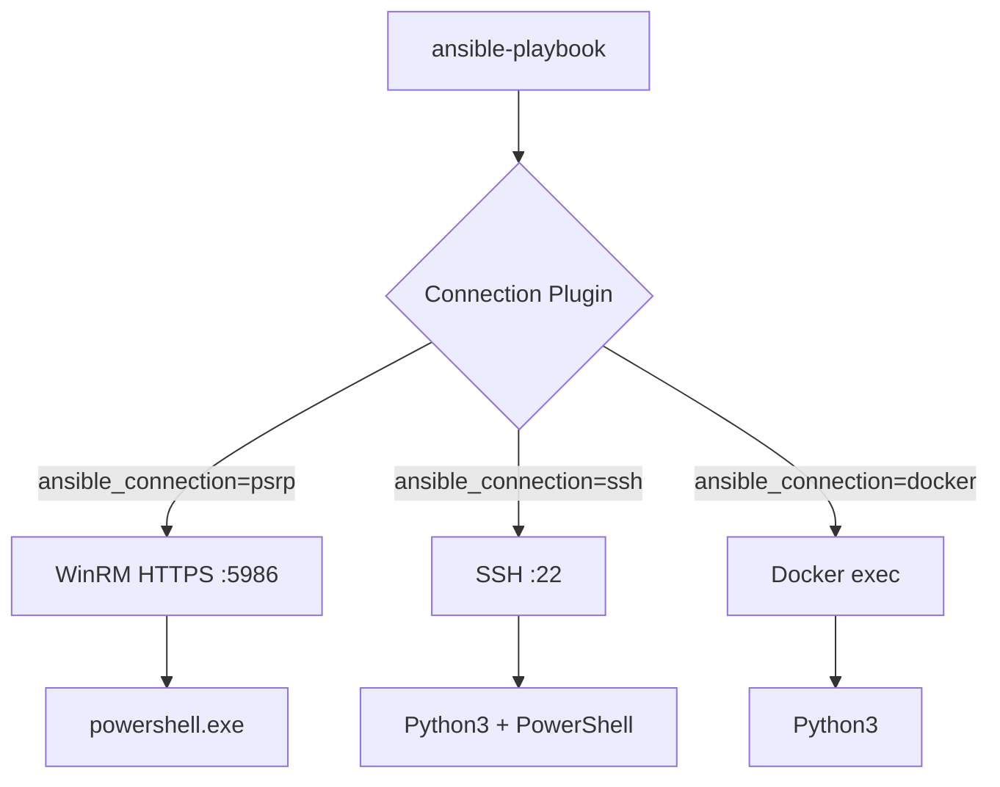
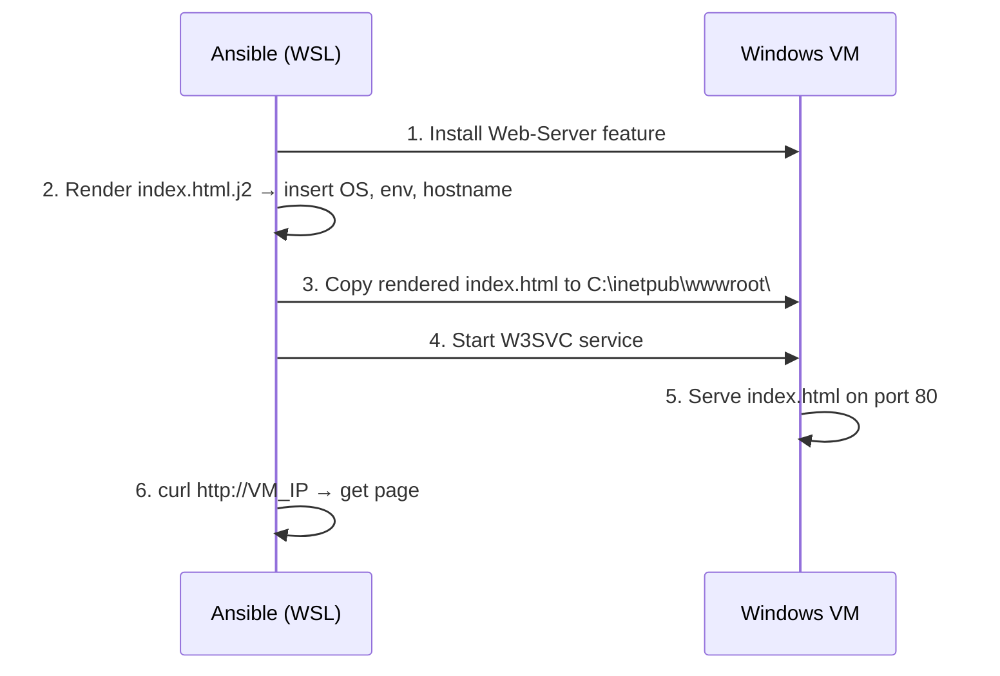

# Overview

What you'll build, in order: a Windows host in Azure (Terraform) → a working Ansible connection to it (WinRM/PSRP) → a first playbook and variables → secrets in Vault → Jinja2 templating → a real deployed app (PHP + IIS + SQLite guestbook) → that app turned into a reusable role → dynamic inventory → a CI/CD pipeline that runs the whole thing.

| # | Section | Covers |
|---|---------|--------|
| 1 | [Hosts Setup](#section-1--hosts-setup-terraform--docker) | Terraform + Docker |
| 2 | [Why Ansible](#section-2--why-ansible) | Agentless, idempotent, IaC |
| 3 | [Install Ansible](#section-3--install-ansible-python-venv--ad-hoc-basics) | Python venv + ad-hoc basics |
| 4 | [Connections](#section-4--connections-winrm-vs-psrp) | WinRM vs PSRP |
| 5 | [Static Inventory](#section-5--static-inventory--first-connection-guide-22-26) | First connection |
| 6 | [First Playbook + Facts](#section-6--first-playbook--facts) | `gather_facts`, `ansible.cfg` |
| 7 | [Variables + Precedence](#section-7--variables--precedence) | group/host vars, FQCN |
| 8 | [Vault](#section-8--vault) | Encrypting secrets |
| 9 | [Jinja2 Templating](#section-9--jinja2-templating) | Basics, IIS + Docker/Nginx examples, collections |
| 10 | [Guestbook App](#section-10--guestbook-app-php--iis--sqlite) | Real PHP + IIS + SQLite deployment |
| 11 | [Roles + Handlers](#section-11--roles--handlers-guide-52-57) | Converting the app into a role |
| 12 | [CI/CD](#section-13--cicd-optional) | Azure DevOps pipeline |

---

## Section 1 — Hosts Setup (Terraform + Docker)

### Azure Resources Terraform Creates



### Terraform Commands

```bash
cd terraform
terraform init && terraform fmt && terraform validate
terraform import azurerm_resource_group.winrm /subscriptions/89d4fdd2-c376-4dc8-a461-fd467b017bcc/resourceGroups/<your-rg-name>
terraform plan
terraform apply
terraform output
```

Output example:
```
public_ip     = "20.x.x.x"
resource_group_name = "ansible-winvm01-rg"
vm_name       = "ansible-winvm01-vm"
computer_name = "web-winvm01"
```

```
 docker run -d --name ansible-test --rm alpine sleep 6000
```

```
docker run -d --name ansible-test1 --rm python:3.14.7-bookworm sleep 6000
```

> Keep these two containers running — `ansible-test` (Alpine, no Python) and `ansible-test1` (has Python) come back in Section 5 to demonstrate why Ansible needs Python on every managed node.

---

## Section 2 — Why Ansible

1. **Agentless** — No daemon on managed nodes. SSH/WinRM is already there. Install Ansible on one machine, control thousands.
2. **Idempotent***(*with astreik*) — Run same playbook 100 times, result is the same. `state: present` doesn't re-install if already present.
3. **Reads like English** — YAML tasks describe *what* you want, not *how*. `win_feature: { name: Web-Server, state: present }` — students can read it day one.
4. **One language, all platforms***(*with astreik*) — Same Ansible playbook configures Windows (WinRM), Linux (SSH), and Docker containers. No separate tool per OS.
5. **Infrastructure as Code** — Playbooks are versioned in Git. Track changes, review PRs, rollback. `terraform.tfvars` creates the VM; Ansible playbooks configure what's inside.

---

## Section 3 — Install Ansible (Python venv) + Ad-hoc Basics

```bash
# In WSL Ubuntu
sudo apt install -y python3 python3-pip python3-venv git curl jq openssl netcat-openbsd
python3 -m venv .venv
source .venv/bin/activate
pip install ansible==14.3.1 pypsrp==0.9.1 "molecule[delegated]" molecule-plugins
ansible --version
```


```bash
ansible localhost -m ping
```

```bash
ansible localhost -m command -a "uname -a"
```

```bash
ansible localhost -m shell -a "df -h"
```

> **A module is a unit of work Ansible knows how to perform.**

> [It is just python code underneath.](https://github.com/ansible/ansible/blob/devel/lib/ansible/modules/ping.py)

```ini
[local]
localhost ansible_connection=local
```

Run:

```bash
ansible -i inventory.ini local -m ping
```

## Section 4 — Connections: WinRM vs PSRP

| | WinRM | PSRP |
|---|---|---|
| **What** | Windows Remote Management — HTTP/HTTPS protocol for remote commands | PowerShell Remoting Protocol — runs PowerShell specifically over WinRM |
| **Port** | 5985 (HTTP) / 5986 (HTTPS) | 5986 (same transport, different protocol layer) |
| **Inventory var** | `ansible_connection=winrm` | `ansible_connection=psrp` |
| **When to use** | Older or generic Windows targets | Modern Windows (recommended) — better error handling, native PowerShell |
| **Needs on target** | WinRM service running | WinRM service + PowerShell (built-in on Server 2012+) |

**TL;DR:** PSRP is the better version of WinRM for Ansible. Both use the same port (5986). PSRP sends PowerShell objects directly; WinRM sends text strings that the target interprets. Use `psrp`.

### How it works on the remote node

**WinRM** (`ansible_connection=winrm`):

```text
Control Node                          Managed Node (Windows)
┌──────────────┐                      ┌────────────────────────────────┐
│ ansible      │──── HTTPS :5986 ────▶│ WinRM Service                  │
│              │                      │   ├─ Receive: "Get-Service W3SVC"│
│              │◀─── JSON ───────────   ├─ Execute via cmd.exe        │
└──────────────┘                      │   └─ Return: {stdout, rc}      │
                                      └────────────────────────────────┘
```

Text goes in → `cmd.exe` or `powershell.exe` interprets it → result text comes back as JSON.

**PSRP** (`ansible_connection=psrp`):

```text
Control Node                          Managed Node (Windows)
┌──────────────┐                      ┌────────────────────────────────┐
│ ansible      │──── HTTPS :5986 ────▶│ WinRM Service                  │
│              │                      │   ├─ Receive: serialized object │
│              │◀─── JSON ───────────│   ├─ Execute in PowerShell      │
└──────────────┘                      │   └─ Return: structured object │
                                      └────────────────────────────────┘
```

PowerShell objects go in → PowerShell runtime executes directly → structured object comes back. No cmd.exe shell.

**Same task, different path:**

```text
ansible.windows.win_service: { name: W3SVC }

WinRM:  sends string "Get-Service W3SVC" → cmd.exe → runs PowerShell → parses text output
PSRP:   sends object {ModuleName: "W3SVC"} → PowerShell.exe → returns ServiceController object directly
```

> PSRP handles errors, output types, and large results better because it speaks PowerShell natively.

---

## Section 5 — Static Inventory + First Connection 

Recap — which connection plugin routes where:

Verify the port is reachable from WSL before pointing Ansible at it:
```bash
nc -zv <PUBLIC_IP> 5986
# Connection to <PUBLIC_IP> 5986 port [tcp/wsmans] succeeded!
```

Troubleshoot order (teach this):
```
Public IP → NSG → Windows Firewall → WinRM service → Listener → Certificate → Ansible
```

Create `inventory/windows.ini`:

```ini
[windows]
winvm01 ansible_host=20.x.x.x

[windows:vars]
ansible_connection=psrp
ansible_port=5986
ansible_user=<your-name>
ansible_password=<password>
ansible_psrp_auth=basic
ansible_psrp_cert_validation=ignore
```

Ad-hoc test:
```bash
ansible -i inventory/windows.ini windows -m ansible.windows.win_ping
# winvm01 | SUCCESS => {"changed": false, "ping": "pong"}
```

#### Fun Fact — `win_ping` Is Not Ping

```text
Does win_ping send ICMP packets?
```

> No. `win_ping` is an Ansible module that verifies communication with a Windows host — it doesn't send ICMP.

Actual network connectivity can be checked separately:
```bash
nc -zv <IP> 5986
# or
ping <IP>   # although ICMP can be blocked
```

Now do the same thing as a playbook instead of an ad-hoc command — `playbooks/ping.yml`:
```yaml
---
- name: Test Windows connectivity
  hosts: windows
  gather_facts: false
  tasks:
    - ansible.windows.win_ping:
```

```bash
ansible-playbook -i inventory/windows.ini playbooks/ping.yml
```

---

### Putting it together — what just happened

1. **You write a playbook** (`ping.yml`) describing tasks against a `hosts:` group.
2. **Ansible reads the inventory** (`windows.ini`) to resolve `windows` into `winvm01`.
3. **The connection plugin** (`psrp`, from Section 4) decides how to reach it — WinRM HTTPS on :5986.
4. **The target needs Python (or PowerShell for Windows).** Modules are scripts Ansible copies to the target and executes there — no Python/PowerShell runtime, no result. Try it against the two containers from Section 1:
   ```bash
   ansible ansible-test -m ping -e "ansible_connection=docker" -i "ansible-test,"
   ansible ansible-test1 -m ping -e "ansible_connection=docker" -i "ansible-test1,"
   ```
   ```text
   ansible-test  (Alpine, no Python) | UNREACHABLE! "Failed to create temporary directory"
   ansible-test1 (has Python)        | SUCCESS => {"changed": false, "ping": "pong"}
   ```
   Same lesson applies to Windows: no PowerShell/WinRM listener, no result.




| Connection | Transport | Managed Node Needs | Use Case |
|-----------|-----------|-------------------|----------|
| `psrp` | WinRM HTTPS :5986 | PowerShell | Windows (recommended, see Section 4) |
| `winrm` | WinRM HTTPS :5986 | PowerShell | Windows (older) |
| `ssh` | SSH :22 | Python3 | Linux / Windows (OpenSSH) |
| `docker` | Docker API | Python3 | Local containers |


---

## Section 6 — First Playbook + Facts


Playbook:

`playbooks/facts.yml`

``` yaml
---
- name: Gather Windows information
  hosts: windows
  gather_facts: false
  tasks:
    - name: Show Windows hostname
      ansible.builtin.debug:
        var: ansible_hostname

    - name: Show OS family
      ansible.builtin.debug:
        var: ansible_os_family

    - name: Show operating system
      ansible.builtin.debug:
        var: ansible_distribution

    - name: Print all gather_facts
      ansible.builtin.debug:
        var: ansible_facts
```

Run:

``` bash
ansible-playbook \
  -i inventory/windows.ini \
  playbooks/facts.yml
```

Now change:

``` yaml
gather_facts: false
```

to:

``` yaml
gather_facts: true
```


Run:

``` bash
ansible-playbook \
  -i inventory/windows.ini \
  playbooks/facts.yml
```


> Facts=information Ansible discovers about the managed machine

### `ansible.cfg`

Ansible reads `ansible.cfg` from the working directory (or `~/.ansible.cfg`, `/etc/ansible/ansible.cfg`). It sets defaults so you don't pass flags every time.

```ini
# ansible.cfg
[defaults]
inventory = inventory/windows.ini
interpreter_python = /usr/bin/python3
remote_tmp = /tmp/.ansible/tmp
gathering = smart
fact_caching = memory

[privilege_escalation]
become = false
```

- `inventory` — default inventory, skip `-i` flag
- `interpreter_python` — lock Python path, kill `[WARNING] discovered interpreter`
- `remote_tmp` — fix `/tmp` issues on minimal containers
- `gathering = smart` — cache facts, only re-gather when host changes
- `gathering = explicit` — **never gather unless playbook says `gather_facts: true`** — saves time when you don't need OS info


---

## Section 7 — Variables + Precedence

in `playbook/hello.yml`
```yaml
---
- name: Write hello world to desktop
  hosts: windows
  tasks:
    - name: Write hello world text file to desktop
      ansible.windows.win_copy:
        content: "hello world"
        dest: "C:\\User\\<username>\\Desktop\\hello.txt"

    - name: Create application directory
      ansible.windows.win_file:
        path: "C:\\apps\\training"
        state: directory

```

```
ansible-playbook -i inventory/windows.ini playbooks/hello.yml
```

### Variable files

`group_vars/windows.yml`:
```yaml
---
application_name: "Training IIS"
application_path: "C:\\apps\\training"
iis_site_name: "TrainingSite"
iis_port: 8080
environment: "development"
```

```yaml
---
- name: Write hello world to desktop
  hosts: windows
  tasks:
    - name: Write hello world text file to desktop
      ansible.windows.win_copy:
        content: "hello world"
        dest: "{{ ansible_facts['env'].USERPROFILE }}\\Desktop\\hello.txt"

    - name: Create application directory
      ansible.windows.win_file:
        path: "{{ training_path }}"
        state: directory

    - name: Show host variable value
      ansible.builtin.debug:
        msg: "training_path for {{ inventory_hostname }} is {{ training_path }}"
```

Start simple `playbooks/variables.yml`:
```yaml
---
- name: Variable demonstration
  hosts: windows
  vars:
    application_name: "Training IIS Application"
    application_port: 8080
  tasks:
    - name: display app name
      debug:
        msg: "Application: {{ application_name }}"
    - name: display container port
      debug:
        msg: "Application port: {{ application_port }}"
```

`debug:` and `ansible.builtin.debug:` are the **same module** — Ansible resolves both.

| Form | Example | When to use |
|------|---------|-------------|
| **Short** | `debug: { msg: "hi" }` | Quick labs, playbooks you write yourself |
| **FQCN** | `ansible.builtin.debug: { msg: "hi" }` | Production, roles, shared code — tells Ansible exactly which collection to use |

**Why FQCN exists:** If two collections both have a `debug` module, Ansible doesn't know which to pick. FQCN removes ambiguity:

```yaml
- ansible.builtin.debug: { msg: "builtin" }      # from ansible-core
- community.general.debug: { msg: "community" }   # hypothetical — different module
```

**Rule of thumb for this lab:** Short form is fine for playbooks you write. When you start using roles and collections from Galaxy, use FQCN.


### Variable files

`group_vars/windows.yml`:
```yaml
---
application_name: "Training IIS"
application_path: "C:\\apps\\training"
iis_site_name: "TrainingSite"
iis_port: 8080
environment: "development"
```

```bash
ansible-playbook -i inventory/windows.ini playbooks/variables.yml
```

Playbook reads them automatically (no `-e` needed).

> you can do ansible dry check to check which variable preceds

### Precedence experiment

1. `group_vars/windows.yml: application_port: 8080` → output: `Port: 8080`
2. Add play `vars: { application_port: 9090 }` → output: `Port: 9090`
3. `ansible-playbook ... -e "application_port=9999"` → output: `Port: 9999`

```
-e (wins)
Play/task vars
Host vars
Group vars
Defaults
```


### Host vars (per-host override)

`host_vars/winvm01.yml`:
```yaml
training_path: C:\apps\training
department: "Engineering"        
app_environment: "development"       # for conditional demo
allowed_users: [aaditya, contoso, admin]  # for loop demo

```

`playbooks/variables.yml` uses `path: "{{ training_path }}"` — no change. Add `student02` with different path → same playbook, different per-host value.

#### Why Variables Matter

Without variables:

``` yaml
path: C:\apps\training
```

With variables:

``` yaml
path: "{{ application_path }}"
```

Now the same role can use:

``` text
Development:
C:\apps\training-dev

Production:
C:\apps\training
```

**How it works:** Ansible loads `group_vars/<group>.yml` based on which group the host belongs to. Dev hosts are in `[development]` group → get `development.yml`. Prod hosts are in `[production]` group → get `production.yml`. Same variable name, different value.

**Just an example(dont do this):**

```ini
# inventory/windows.ini
[development]
dev01 ansible_host=20.10.1.10
dev02 ansible_host=20.10.1.11

[production]
prod01 ansible_host=20.10.2.10
prod02 ansible_host=20.10.2.11
```

```yaml
# group_vars/development.yml
application_path: "C:\\apps\\training-dev"
environment: "development"
iis_port: 8080
```

```yaml
# group_vars/production.yml
application_path: "C:\\apps\\training"
environment: "production"
iis_port: 80
```

```bash
ansible-playbook -i inventory/windows.ini playbooks/iis.yml -l development
# → dev01, dev02 get C:\apps\training-dev, port 8080

ansible-playbook -i inventory/windows.ini playbooks/iis.yml -l production
# → prod01, prod02 get C:\apps\training, port 80
```

Same playbook, same role, same template — different `group_vars` file per environment.
---

## Section 8 — Vault

```bash
mkdir -p group_vars/windows
ansible-vault create group_vars/windows/vault.yml
# Enter password, then:
# these are just examples(dont follow this part)
app_db_server: "sql-training.database.windows.net"
app_db_name: "training"
app_db_username: "training_app"
app_db_password: "REPLACE_WITH_SECRET"

#do this
ansible_password: "<replace with your host password from inventory>"
```

```bash
cat group_vars/windows/vault.yml
```

Run:
```bash
ansible-playbook -i inventory/windows.ini playbooks/iis.yml --ask-vault-pass
# or --vault-password-file ~/.ansible-vault-password (chmod 600, never commit)
```

### Move inventory credentials to vault

**Before (plaintext in git — never do this):**

```ini
# inventory/windows.ini
[windows:vars]
ansible_user=aaditya
ansible_password=!BRr39E,BAPUWq
```

**After (encrypted in vault):**

```ini
# inventory/windows.ini
[windows:vars]
ansible_user=aaditya
# ansible_password removed — now in vault
```

```yaml
# group_vars/windows/vault.yml (encrypted)
---
ansible_password: "!BRr39E,BAPUWq"
#app_db_password: "SuperSecret123"
```

```bash
ansible-vault encrypt group_vars/windows/vault.yml
cat group_vars/windows/vault.yml  # $ANSIBLE_VAULT;1.1;AES256

# run with vault
ansible-playbook -i inventory/windows.ini playbooks/iis.yml --ask-vault-pass
```

> `ansible_password` is just a variable like any other — Ansible reads it from vault. Git now sees only the encrypted file.

instead of `--ask-vault-pass` every time you can do

```
# ansible.cfg
[defaults]
vault_password_file = ~/.ansible-vault-password
```

```
# create vault password file
echo "MyVaultPass123" > ~/.ansible-vault-password
chmod 600 ~/.ansible-vault-password
```

```
# now run without --ask-vault-pass
ansible-playbook -i inventory/windows.ini playbooks/iis.yml
```

### another opption: env var (best for CI/CD)

```
export VAULT_PASSWORD_FILE=~/.ansible-vault-password
ansible-playbook -i inventory/windows.ini playbooks/iis.yml
# vault password is read automatically
```

---

## Section 9 — Jinja2 Templating

Jinja2 is a templating engine. Ansible uses it to render config files with variables.

### Jinja2 in 2 Minutes

#### Before (hardcoded)

`hello.yml`:
```yaml
- ansible.windows.win_copy:
    content: "hello world"
    dest: "{{ ansible_facts['env'].USERPROFILE }}\\Desktop\\hello.txt"
```

#### After (template with variables)

Create `templates/hello.txt.j2`:
```jinja2

Hello {{ ansible_facts['env'].COMPUTERNAME }}!

User: {{ ansible_facts['env'].USERNAME }}          {# Variable: {{ variable }} #}
User (upper): {{ ansible_facts['env'].USERNAME | upper }}  {# Filter: | upper -> AADITYA #}
Department: {{ department | default("n/a") }}       {# Default: n/a if undefined #}

               {# Conditional #}
Environment: DEV — debug mode ON

Environment: PROD


Allowed users:                                     {# Loop #}

- {{ user }}


Host: {{ inventory_hostname }}
Date: {{ ansible_date_time.date }}

```

Update `hello.yml`:
```yaml
- ansible.windows.win_template:
    src: ../templates/hello.txt.j2
    dest: "{{ ansible_facts['env'].USERPROFILE }}\\Desktop\\hello.txt"
```

Result on VM:
```
Hello WEB-01!

User: aaditya
Host: winvm01
Date: 2026-08-24
```

**Key Jinja2 features:**

| Syntax | Example | Output |
|--------|---------|--------|
| Variable | `{{ variable }}` | `aaditya` |
| Filter | `{{ name \| upper }}` | `AADITYA` |
| Default | `{{ x \| default("n/a") }}` | `n/a` if x is undefined |
| Conditional | `true` | `true` if dev |
| Loop | `{{ i }}` | all items |

> **Rule:** Put logic in variables, not templates. Keep templates simple.

---

### Simplest IIS + Jinja2 Example

#### 1. Template: `templates/index.html.j2`

```html
<html>
<body>
<h1>Hello from {{ inventory_hostname }}!</h1>
<p>OS: {{ ansible_os_family }}</p>
<p>Environment: {{ environment }}</p>
</body>
</html>
```

#### 2. Playbook: `playbooks/simple_iis.yml`

```yaml
---
- name: Simple IIS with Jinja2
  hosts: windows
  gather_facts: true
  vars:
    environment: "development"
  tasks:
    - name: Install IIS
      ansible.windows.win_feature:
        name: Web-Server
        state: present

    - name: Create index.html from template
      ansible.windows.win_template:
        src: templates/index.html.j2
        dest: C:\inetpub\wwwroot\index.html

    - name: Ensure IIS is running
      ansible.windows.win_service:
        name: W3SVC
        state: started
```


#### What just happened?



---

### Docker + Nginx + Jinja2 Example

#### 1. Template: `templates/nginx.conf.j2`

```nginx
server {
    listen 80;
    server_name {{ inventory_hostname }};

    location / {
        root /usr/share/nginx/html;
        index index.html;
    }
}
```
#### 2. Template: `templates/index.html.j2`

```html
<html>
<body>
<h1>Hello from {{ inventory_hostname }}!</h1>
<p>OS: {{ ansible_os_family }}</p>
<p>Container: {{ ansible_module_container_id }}</p>
<h3>Port: {{ nginx_port }}</h3>
<h3>Greetings: {{ greeting }} </h3>
</body>
</html>
```

# Spin up container
```
docker run -d --name web01 \
  -p 8001:80 \
  python:3.14.7-bookworm sleep infinity
```
```
docker run -d --name web02 \
  -p 8002:80 \
  python:3.14.7-bookworm sleep infinity
```

> docker exec web01 bash -c "apt-get update && apt-get install -y nginx && nginx"
> you would manually configure this above and write nginx config manually


#### Ansible does the same thing

```yaml
# playbooks/nginx1.yml
---
- name: Docker + Nginx with Jinja2
  hosts: all
  gather_facts: true
  tasks:
    - name: Update apt cache
      ansible.builtin.apt:
        update_cache: yes

    - name: Install nginx
      ansible.builtin.apt:
        name: nginx
        state: present

    - name: Get container facts
      community.docker.current_container_facts:

    - name: Show container ID
      ansible.builtin.debug:
        msg: "Container ID: {{ ansible_module_container_id }}"


    - name: Render nginx.conf from template
      ansible.builtin.template:
        src: ../templates/nginx.conf.j2
        dest: /etc/nginx/sites-available/default

    - name: Render index.html from template
      ansible.builtin.template:
        src: ../templates/index.html.j2
        dest: /usr/share/nginx/html/index.html

    - name: Start nginx
      ansible.builtin.service:
        name: nginx
        state: started

```

> Add to `inventory/linux.ini`:
```ini
[linux]
web01 ansible_connection=docker ansible_python_interpreter=/usr/local/bin/python3.14
web02 ansible_connection=docker ansible_python_interpreter=/usr/local/bin/python3.14
```

# group_vars (same port for all containers)

```yaml
# group_vars/linux.yml
---
greeting: "hello from group_vars"

```

All hosts in `[linux]` group get `greeting: "hello from group_vars"`.

host_vars (different port per container)

```yaml
# host_vars/web01.yml
---
nginx_port: 8001
```

```yaml
# host_vars/web02.yml
---
nginx_port: 8002
```

Each host gets its own port.


#### 3. Playbook: `playbook/nginx.yml`

```yaml
---
- name: Simple Nginx with Jinja2
  hosts: linux
  gather_facts: true
  vars:
    container_name: "web02"
    nginx_port: 8002
  tasks:
    - name: Create HTML from template
      ansible.builtin.template:
        src: templates/index.html.j2
        dest: /tmp/index.html

    - name: Create Nginx config from template
      ansible.builtin.template:
        src: templates/nginx.conf.j2
        dest: /tmp/default.conf

    - name: Run Nginx container
      community.docker.docker_container:
        name: "{{ container_name }}"
        image: nginx:latest
        state: started
        ports:
          - "{{ nginx_port }}:80"
        volumes:
          - /tmp/index.html:/usr/share/nginx/html/index.html:ro
          - /tmp/default.conf:/etc/nginx/conf.d/default.conf:ro
```

#### 4. Inventory: `inventory/linux.ini`

```ini
[linux]
web01 ansible_connection=local
web02 ansible_connection=local

[linux:vars]
ansible_python_interpreter=/usr/bin/python3
```

> `ansible_connection=local` runs directly in WSL (no SSH needed). For remote Linux hosts use `ansible_connection=ssh`.

#### 4. Run and verify

```bash
ansible-playbook -i inventory/linux.ini playbooks/nginx.yml
curl http://localhost:8000/
# Hello from ubuntu01!
# OS: Debian
# Container: web01
# Port: 8000
```

### Side by side: Windows vs Linux

```text
Windows (IIS)                          Linux (Nginx)
┌──────────────────────┐               ┌──────────────────────┐
│ win_feature          │               │ docker_container     │
│   name: Web-Server   │               │   image: nginx       │
│                      │               │   ports: 8000 → 80   │
│ win_template         │               │ template             │
│   src: index.html.j2 │               │   src: index.html.j2 │
│                      │               │                      │
│ win_service: W3SVC   │               │ (Docker manages)     │
│                      │               │                      │
│ Port: 80 (default)   │               │ Port: 8000 (mapped)  │
└──────────────────────┘               └──────────────────────┘
```

### Collections: Module vs Plugin vs Role

Collections are like npm packages or pip packages — they bundle related modules, plugins, and roles together.

# MODULE — runs on the target, does the work
tasks:
  - ansible.windows.win_feature:        # module
      name: Web-Server
      state: present

# PLUGIN — extends Ansible (connection, inventory, etc.)
[defaults]
gathering = smart          # fact gathering plugin
inventory = azure_rm.yml   # inventory plugin

# ROLE — packages everything together
roles:
  - iis                    # contains tasks, templates, handlers


**One-liner:**
- **Module** = "install nginx on the target"
- **Plugin** = "how Ansible connects to the target" or "how Ansible finds targets"
- **Role** = "a bundle of modules + templates + logic that configures a service"

> exploring community docker collection [ansible galaxy docker docs](https://galaxy.ansible.com/ui/repo/published/community/docker/content/module/docker_container/#examples)

#### Playbook: `playbooks/docker_nginx.yml`

```yaml
---
- name: Create Docker container
  hosts: ubuntu
  gather_facts: false

  vars:
    container_name: "web03"
    nginx_port: 8003

  tasks:
    - name: Create temp dir for nginx files
      ansible.builtin.file:
        path: "/tmp/nginx/{{ container_name }}"
        state: directory
        mode: "0755"

    - name: Render nginx.conf from template
      ansible.builtin.template:
        src: ../templates/nginx.conf.j2
        dest: "/tmp/nginx/{{ container_name }}/default.conf"
        mode: "0644"

    - name: Render index.html from template
      ansible.builtin.template:
        src: ../templates/index.html.j2
        dest: "/tmp/nginx/{{ container_name }}/index.html"
        mode: "0644"

    - name: Spin up Ubuntu container with Python
      community.docker.docker_container:
        name: "{{ container_name }}"
        image: python:3.14.7-bookworm
        state: started
        command: sleep infinity
        expose:
          - "80"
        ports:
          - "{{ nginx_port }}:80"
        volumes:
          - "/tmp/nginx/{{ container_name }}/default.conf:/etc/nginx/sites-available/default:ro"
          - "/tmp/nginx/{{ container_name }}/index.html:/tmp/index.html:ro"


- name: Configure nginx inside container
  hosts: web03
  gather_facts: true

  tasks:
    - name: Update apt cache
      ansible.builtin.apt:
        update_cache: true

    - name: Install nginx
      ansible.builtin.apt:
        name: nginx
        state: present

    - name: Copy custom index.html
      ansible.builtin.copy:
        src: /tmp/index.html
        dest: /usr/share/nginx/html/index.html
        remote_src: true


    - name: Start nginx
      ansible.builtin.service:
        name: nginx
        state: started

```

```index.html.j2
<html>
<body>
<h1>Hello from {{ inventory_hostname }}!</h1>
<p>Container: {{ container_name }}</p>
<h3>Port: {{ nginx_port }}</h3>
<h3>Greetings: {{ greeting }} </h3>
</body>
</html>
```

write inventory file
```
[linux]
ubuntu ansible_connection=local
web03 ansble_connection=docker
```

#### 3. Run and verify

```bash
ansible-playbook -i inventory/linux.ini playbooks/docker_nginx.yml
curl http://localhost:8001/
# Hello from ubuntu01!
# OS: Debian
# Container: web01
# Port: 8001
```


```
ansible-galaxy collection list
```

> as you can see there are bunch of collections already installed. when we did `pip install ansible`, it install ansible distribution rather than `ansible-core` which is just the engine.


**`ansible` (14.3.1)** = `ansible-core` + 80+ collections pre-installed
**`ansible-core` (2.21.3)** = just the engine, no collections

```yaml
# requirements.yml
collections:
  - name: ansible.windows
  - name: community.docker
  - name: azure.azcollection
```


```
ansible-galaxy collection install -r requirements.yml
# installs all 3 at once
```

---

## Section 10 — Guestbook App: PHP + IIS + SQLite

### The Application: Student Guestbook

```
Install PHP
    ↓
Enable CGI
    ↓
Create application directory
    ↓
Create IIS website
    ↓
Connect PHP to IIS
    ↓
Enable SQLite
    ↓
Deploy PHP application
    ↓
Restart IIS if required
```

```host_vars/winvm01.yml
---
---
# IIS site configuration
iis_site_name: "TrainingSite"
application_path: "C:\\apps\\training"

# PHP configuration (Chocolatey installs to C:\\tools\\php)
php_dir: "C:\\tools\\php"
php_cgi_path: "C:\\tools\\php\\php-cgi.exe"
php_path: "C:\\tools\\php85\\php-cgi.exe"

# PHP guestbook app
application_name: "Guestbook - DEV"
app_environment: "development"
database_path: "C:\\apps\\training\\database.sqlite"
```

```playbook/setup_iis.yml

# Ansible IIS + PHP + SQLite

This playbook prepares a Windows server with IIS, PHP, SQLite support,
and deploys a simple PHP application.

## Playbook

---
- name: Setup IIS with PHP and SQLite
  hosts: windows
  gather_facts: false
  tasks:

    # -------------------------------------------------
    # PHP
    # -------------------------------------------------

    # Installs PHP using the Chocolatey package manager.
    - name: Install PHP
      chocolatey.chocolatey.win_chocolatey:
        name: php
        state: present

    # Enables the IIS CGI feature required to run PHP through FastCGI.
    - name: Enable IIS CGI
      ansible.windows.win_feature:
        name: Web-CGI
        state: present

    # -------------------------------------------------
    # Application directory
    # -------------------------------------------------
    # Creates the directory where the PHP application will be hosted.
    - name: Create application directory
      ansible.windows.win_file:
        path: "{{ application_path }}"
        state: directory
        # -------------------------------------------------
        # IIS
        # -------------------------------------------------
    # Removes the default IIS website so port 80 can be used by our application.
    - name: Remove Default Web Site
      microsoft.iis.website:
        name: "Default Web Site"
        state: absent

    # Creates our IIS website and points it to the application directory.
    - name: Create application website
      microsoft.iis.website:
        name: "{{ iis_site_name }}"
        physical_path: "{{ application_path }}"
        state: started
        bindings:
          set:
            - ip: "*"
              port: 80


    # -------------------------------------------------
    # PHP FastCGI
    # -------------------------------------------------
    # Adds PHP to IIS FastCGI so IIS knows how to execute .php files.
    - name: Register PHP FastCGI
      community.windows.win_xml:
        path: 'C:\Windows\System32\inetsrv\config\applicationHost.config'
        xpath: /configuration/system.webServer/fastCgi
        fragment: '<application fullPath="{{ php_path }}" maxInstances="4" instanceMaxRequests="10000" />'
        state: present

    # -------------------------------------------------
    # SQLite
    # -------------------------------------------------
    # Iterates over the PHP configuration and uncomment/enables the SQLite
    # extensions required by the application.
    - name: Enable PHP SQLite extensions
      community.windows.win_lineinfile:
        path: C:\tools\php85\php.ini
        regex: '^;?extension={{ item }}$'
        line: 'extension={{ item }}'
      loop:
        - pdo_sqlite
        - sqlite3
      notify: Restart IIS

    # -------------------------------------------------
    # Application
    # -------------------------------------------------
    # Generates web.config from a Jinja2 template.
    # This config tells IIS how to handle PHP requests.
    - name: Deploy web.config
      ansible.windows.win_template:
        src: ../templates/web.config.j2
        dest: "{{ application_path }}\\web.config"
      when:
        - app_environment == "development"
        #- confirm_deploy | default(false) | bool

    # Copies the static database.php file to the IIS application directory.
    - name: Deploy database.php
      ansible.windows.win_copy:
        src: ../files/guestbook/database.php
        dest: "{{ application_path }}\\database.php"

    # Generates index.php from a Jinja2 template.
    # Ansible variables can be inserted into the PHP file.
    - name: Deploy index.php
      ansible.windows.win_template:
        src: ../templates/index.php.j2
        dest: "{{ application_path }}\\index.php"

    # Generates the application configuration from a Jinja2 template.
    - name: Deploy application config
      ansible.windows.win_template:
        src: ../templates/config.php.j2
        dest: "{{ application_path }}\\config.php"

  handlers:

    # Restarts IIS only when a task notifies this handler.
    - name: Restart IIS
      ansible.windows.win_service:
        name: W3SVC
        state: restarted

```


`database.php` (static — same in every environment):
```file/database.php
<?php
$db = new PDO('sqlite:' . __DIR__ . '/database.sqlite');
$db->setAttribute(PDO::ATTR_ERRMODE, PDO::ERRMODE_EXCEPTION);
$db->exec("
    CREATE TABLE IF NOT EXISTS messages (
        id INTEGER PRIMARY KEY AUTOINCREMENT,
        name TEXT NOT NULL,
        message TEXT NOT NULL,
        created_at DATETIME DEFAULT CURRENT_TIMESTAMP
    )
");
```

`index.php.j2` — same PHP as a static `index.php` would have, but the title is now a Jinja2 variable:
```templates/index.php.j2
<?php
require_once 'database.php';

if ($_SERVER['REQUEST_METHOD'] === 'POST') {
    $name = trim($_POST['name'] ?? '');
    $message = trim($_POST['message'] ?? '');
    if ($name !== '' && $message !== '') {
        $stmt = $db->prepare("INSERT INTO messages (name, message) VALUES (:name, :message)");
        $stmt->execute([':name' => $name, ':message' => $message]);
    }
    header('Location: /');
    exit;
}

$stmt = $db->query("SELECT name, message, created_at FROM messages ORDER BY id DESC");
$messages = $stmt->fetchAll(PDO::FETCH_ASSOC);
?>
<!DOCTYPE html>
<html>
<head><title>{{ application_name }}</title></head>
<body>
<h1>{{ application_name }} <small>({{ environment }})</small></h1>

<form method="POST">
    <label>Name</label><input type="text" name="name" required>
    <label>Message</label><textarea name="message" rows="4" required></textarea>
    <button type="submit">Submit</button>
</form>

<h2>Messages</h2>
<?php foreach ($messages as $row): ?>
    <div class="message">
        <div class="name"><?= htmlspecialchars($row['name']) ?></div>
        <p><?= htmlspecialchars($row['message']) ?></p>
        <div class="date"><?= htmlspecialchars($row['created_at']) ?></div>
    </div>
<?php endforeach; ?>
</body>
</html>
```

> `web.config.j2` configures **IIS**; `index.php.j2` configures the **app**. Two templates, two layers.
```
<?xml version="1.0" encoding="UTF-8"?>
<configuration>
  <system.webServer>
    <httpErrors errorMode="Detailed" />
    <handlers>
      <add name="PHP_via_FastCGI"
           path="*.php"
           verb="GET,HEAD,POST"
           modules="FastCgiModule"
           scriptProcessor="C:\tools\php85\php-cgi.exe"
           resourceType="Either" />
    </handlers>
    <defaultDocument enabled="true">
      <files>
        <add value="index.php" />
      </files>
    </defaultDocument>
  </system.webServer>
</configuration>
```

`config.php.j2` — the app-layer config chain, deliberately separate from `web.config.j2`:
```php
<?php
return [
    'app_name'    => 'Guestbook - DEV',
    'environment' => 'development',
    'database'    => 'C:\\apps\\training\\database.sqlite',
];
```

```text
Ansible variables → Jinja2 → PHP configuration → Application
```
This is a cleaner demonstration of configuration management than changing an HTML title — the same variable now flows through two independent templates (`web.config.j2` for IIS, `config.php.j2` for the app) at once.

Env files gain two more keys:
- `group_vars/development.yml`: `application_name: "Guestbook - DEV"`, `database_path: "C:\\apps\\training-dev\\database.sqlite"`
- `group_vars/production.yml`: `application_name: "Guestbook"`, `database_path: "C:\\apps\\training\\database.sqlite"`

Same two templates → four rendered files (`web.config` + `index.php` + `config.php` × dev/prod). Keep logic in vars, use filters `| upper | default("x") | replace("-", "_")`.


---

## Section 11 — Roles + Handlers 

```bash
ansible-galaxy role init roles/php_iis
```

```
roles/
└── php_iis/
    ├── tasks/
    │   └── main.yml
    ├── templates/
    │   ├── web.config.j2
    │   ├── index.php.j2
    │   └── config.php.j2
    ├── files/
    │   └── database.php
    ├── handlers/
    │   └── main.yml
    └── defaults/
        └── main.yml
```

### Converting the PHP app into a role

**Before (flat playbook):**
```yaml
# playbooks/iis.yml — everything in one file
- name: Deploy PHP app
  hosts: windows
  tasks:
    - ansible.windows.win_feature: { name: Web-Server, state: present }
    - ansible.windows.win_feature: { name: Web-CGI, state: present }
    - chocolatey.chocolatey.win_chocolatey: { name: php, state: present }
    - ansible.windows.win_template: { src: web.config.j2, dest: ... }
    - ansible.windows.win_template: { src: index.php.j2, dest: ... }
    - ansible.windows.win_copy: { src: database.php, dest: ... }
    - ansible.windows.win_iis_webapplication: { ... }
  handlers:
    - name: restart IIS
      ansible.windows.win_service: { name: W3SVC, state: restarted }
```

**After (role):**

Step 1 — `roles/php_iis/defaults/main.yml` (variables with defaults):
```yaml


<copy from host_vars/winvm01.yml>

```

Step 2 — `roles/php_iis/tasks/main.yml` (tasks from playbook):
```yaml
---
# -------------------------------------------------
# PHP
# -------------------------------------------------

# Installs PHP using the Chocolatey package manager.
- name: Install PHP
  chocolatey.chocolatey.win_chocolatey:
    name: php
    state: present

# Enables the IIS CGI feature required to run PHP through FastCGI.
- name: Enable IIS CGI
  ansible.windows.win_feature:
    name: Web-CGI
    state: present

# -------------------------------------------------
# Application directory
# -------------------------------------------------
# Creates the directory where the PHP application will be hosted.
- name: Create application directory
  ansible.windows.win_file:
    path: "{{ application_path }}"
    state: directory

# -------------------------------------------------
# IIS
# -------------------------------------------------
# Removes the default IIS website so port 80 can be used by our application.
- name: Remove Default Web Site
  microsoft.iis.website:
    name: "Default Web Site"
    state: absent

# Creates our IIS website and points it to the application directory.
- name: Create application website
  microsoft.iis.website:
    name: "{{ iis_site_name }}"
    physical_path: "{{ application_path }}"
    state: started
    bindings:
      set:
        - ip: "*"
          port: 80

# -------------------------------------------------
# PHP FastCGI
# -------------------------------------------------
# Adds PHP to IIS FastCGI so IIS knows how to execute .php files.
- name: Register PHP FastCGI
  community.windows.win_xml:
    path: 'C:\Windows\System32\inetsrv\config\applicationHost.config'
    xpath: /configuration/system.webServer/fastCgi
    fragment: '<application fullPath="{{ php_path }}" maxInstances="4" instanceMaxRequests="10000" />'
    state: present

# -------------------------------------------------
# SQLite
# -------------------------------------------------
# Iterates over the PHP configuration and uncomment/enables the SQLite
# extensions required by the application.
- name: Enable PHP SQLite extensions
  community.windows.win_lineinfile:
    path: C:\tools\php85\php.ini
    regex: '^;?extension={{ item }}$'
    line: 'extension={{ item }}'
  loop:
    - pdo_sqlite
    - sqlite3
  notify: Restart IIS

# -------------------------------------------------
# Application
# -------------------------------------------------
# Generates web.config from a Jinja2 template.
# This config tells IIS how to handle PHP requests.
- name: Deploy web.config
  ansible.windows.win_template:
    src: web.config.j2
    dest: "{{ application_path }}\\web.config"
  when:
    - app_environment == "development"
    #- confirm_deploy | default(false) | bool

# Copies the static database.php file to the IIS application directory.
- name: Deploy database.php
  ansible.windows.win_copy:
    src: database.php
    dest: "{{ application_path }}\\database.php"

# Generates index.php from a Jinja2 template.
# Ansible variables can be inserted into the PHP file.
- name: Deploy index.php
  ansible.windows.win_template:
    src: index.php.j2
    dest: "{{ application_path }}\\index.php"

# Generates the application configuration from a Jinja2 template.
- name: Deploy application config
  ansible.windows.win_template:
    src: config.php.j2
    dest: "{{ application_path }}\\config.php"

```

Step 3 — `roles/php_iis/handlers/main.yml`:
```yaml
---
- name: restart IIS
  ansible.windows.win_service:
    name: W3SVC
    state: restarted
```

Step 4 — Copy templates and files into role:
```bash
cp templates/web.config.j2  roles/php_iis/templates/
cp templates/index.php.j2   roles/php_iis/templates/
cp templates/config.php.j2  roles/php_iis/templates/
cp files/database.php        roles/php_iis/files/
```

Step 5 — Playbook becomes one line:
```yaml
# site.yml
---
- name: Deploy PHP app
  hosts: windows
  roles:
    - php_iis
```

**Why roles?**

| Flat playbook | Role |
|--------------|------|
| Everything in one file | Split by concern (tasks, templates, handlers, defaults) |
| Copy-paste for new hosts | Reuse across playbooks |
| Variables hardcoded | Overridable via `defaults/`, `host_vars/`, `group_vars/` |
| No handlers section | `notify:` works across tasks |
| Hard to test | Can test role independently |

**Override defaults per host:**
```yaml
# host_vars/student02.yml
---
application_name: "Guestbook - PROD"
#app_environment: "production"
database_path: "C:\\apps\\prod\\database.sqlite"
```

Same role, different values per host.


---

## Section 12 — CI/CD (optional)

`azure-pipelines.yml`:
```yaml
trigger: [main]
pool: { vmImage: ubuntu-latest }
variables: { ANSIBLE_FORCE_COLOR: "1" }

stages:
- stage: Validate
  displayName: Validate Ansible
  jobs:
  - job: Lint
    steps:
    - checkout: self
    - task: UsePythonVersion@0 { inputs: { versionSpec: "3.x" } }
    - script: |
        python -m pip install --upgrade pip
        pip install ansible ansible-lint
        ansible-galaxy collection install -r requirements.yml
      displayName: Install
    - script: ansible-lint
      displayName: Lint
    - script: ansible-playbook -i inventory/azure_rm.yml playbooks/site.yml --syntax-check
      displayName: Syntax check

- stage: Deploy
  dependsOn: Validate
  condition: succeeded()
  jobs:
  - job: DeployAnsible
    steps:
    - checkout: self
    - task: UsePythonVersion@0 { inputs: { versionSpec: "3.x" } }
    - script: |
        python -m pip install --upgrade pip
        pip install ansible
        ansible-galaxy collection install -r requirements.yml
      displayName: Install
    - task: AzureCLI@2
      inputs:
        azureSubscription: "YOUR-SERVICE-CONNECTION"
        scriptType: bash
        scriptLocation: inlineScript
        inlineScript: |
          ansible-playbook -i inventory/azure_rm.yml playbooks/site.yml --vault-password-file "$(VAULT_PASSWORD_FILE)"
      displayName: Run Ansible

- stage: Verify
  dependsOn: Deploy
  condition: succeeded()
  jobs:
  - job: Verify
    steps:
    - script: ansible-playbook -i inventory/azure_rm.yml playbooks/verify.yml
      displayName: Verify
```

**Secret handling:** Never commit `VAULT_PASSWORD_FILE`. Create securely in pipeline (service connection / workload identity / secret variable → temp file → remove after).

---


## Reference: Collections Used

| Collection | Purpose | Key Plugins |
|------------|---------|-------------|
| `ansible.windows` | Windows modules | `win_feature`, `win_service`, `win_copy`, `win_template`, `win_ping`, `win_file` |
| `community.windows` | Extra Windows | `win_iis_website`, `win_firewall_rule`, `win_reboot` |
| `azure.azcollection` | Azure integration | `azure_rm` inventory, `azure_rm_virtualmachine` module |
| `chocolatey.chocolatey` | Windows package installs | `win_chocolatey` — used in Section 10 to install PHP |
| `ansible.posix` | Linux basics | `firewalld`, `selinux`, `synchronize` |

Install via `requirements.yml`:
```yaml
collections:
  - name: ansible.windows
  - name: community.windows
  - name: azure.azcollection
  - name: chocolatey.chocolatey
```
```bash
ansible-galaxy collection install -r requirements.yml
```

---

## Quick Reference Commands

```bash
# Static inventory
ansible windows -i inventory/windows.ini -m ansible.windows.win_ping
ansible-playbook -i inventory/windows.ini playbooks/site.yml --ask-vault-pass

# Dynamic inventory
ansible-inventory -i inventory/azure_rm.yml --graph
ansible -i inventory/azure_rm.yml "web:&development" -m ansible.windows.win_ping
ansible-playbook -i inventory/azure_rm.yml playbooks/site.yml --ask-vault-pass -l "web:&development"

# Debug
ansible-config dump --only-changed
ansible-inventory -i inventory/azure_rm.yml --list
nc -zv <IP> 5986

# Verify
curl -I http://<VM_PUBLIC_IP>
```

---
